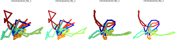

# Chromosomal Structure Tools
ShRec3D algorithm in Python3 and Predicted Chromosomal Structure Visualizer.
# Introduction
## ShRec3D

Implementation of the algorithm described in [3D genome reconstruction from chromosomal contacts](http://www.nature.com/nmeth/journal/v11/n11/full/nmeth.3104.html).

# Preview

> Data From `test/data/mat.csv`
> 
> With Difference Argument.
> 1. -s 0.1 -m -b
> 2. -s 0.1
> 3. -s 1.0 -m -b
> 4. -s 1.0
# Usage
## Requirements
1. python3
2. python package in `requirements.txt`
3. ffmpeg (Optional)

## Coordinates_Calculation
Used to Generate `Coordinates Matrix`.

```shell
usage: Coordinates_Calculation [-h] -f F -o O
ExamPle: 

optional arguments:
  -h, --help  show this help message and exit
  -f F        Path to Balenced Full Size Matrix(CSV).
  -o O        Path to Output(CSV).
```

ExamPle: 
```shell
python3 -u src/Coordinates_Calculation.py -f test/data/mat.csv -o out/Coord.csv
```

## Visualizer
Used to Visualize `chromosomal Structure`.

```shell
usage: Visualizer [-h] -f F -o O -t T [-s S]

optional arguments:
  -h, --help  show this help message and exit
  -f F        Path to coordinates File(csv).
  -o O        Path to Output(SVG).
  -t T        Title of Image.
  -s S        Smooth Factor(Default: 1.0). May be 0.1, 1.0, 2.0,
  -b          Line With Black Border.
  -m          Line End With Marker.
```

> It is Better to use `-b` and `-m` simultaneously, or not to use simultaneously.

ExamPle: 
```shell
python3 -u src/Visualizer.py -f out/Coord.csv -o out/out.svg -t chromosomal_No_1 -b -m
```

# CopyRight Note
The Original implementation of the algorithm is from [kpj/ShRec3D](https://github.com/kpj/ShRec3D.git).
