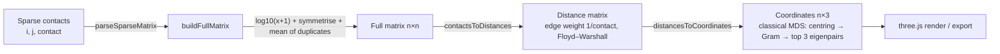

# Chromosomal Structure Tools

Hi-C contact matrices → **ShRec3D** → an interactive 3D model of the chromosome.

Pure frontend: no Python, no backend. A single static page turns a normalized Hi-C contact matrix
into a 3D structure, and exports it as an image, a video, or data. The core algorithm lives in a
dependency-free `src/core.mjs` shared by the browser (via a Web Worker) and the Deno CLI.

The whole project needs **nothing but Deno** — there is no `package.json` and no `node_modules`;
dependencies are written inline as specifiers such as `npm:three@0.186.0`, and the bundle is
produced by Deno's own `deno bundle`.

- Paper:
  [_3D genome reconstruction from chromosomal contacts_](https://www.nature.com/articles/nmeth.3104)
  (Nature Methods, 2014)
- Reference implementation: [kpj/ShRec3D](https://github.com/kpj/ShRec3D)

---

## Quick start

```shell
# Development: build + watch for changes + serve
deno task dev            # → http://127.0.0.1:5173

# Build the static bundle into dist/ (relative paths, host it anywhere)
deno task build
deno task preview        # → http://127.0.0.1:4173
```

There is no HMR in `dev`: saving a file rebuilds in ~0.3 s, then refresh the browser.

The page loads `test/data/sparseMat_Normalized.metrics` (chromosome 1) automatically as a sample;
you can also drop your own `.metrics` / `.tsv` / `.txt` file onto the left panel.

### Requirements

| What      | Needs                                                                       |
| --------- | --------------------------------------------------------------------------- |
| Web page  | A modern browser with WebGL2; the rotation video also needs `MediaRecorder` |
| CLI/build | Deno ≥ 2.4 (for `deno bundle`) — no Node, npm or Python                     |
| Deploy    | Node/npm, for `npx wrangler` (see [Deploy](#deploy-to-cloudflare-workers))  |

### Dependencies and build

- Dependencies are declared inline in the source (only `src/viewer.js` uses `three`), so the version
  is visible right where it is used:

  ```js
  import * as THREE from "npm:three@0.186.0";
  ```

- `deno.json` sets `"nodeModulesDir": "none"`, so npm packages are resolved from Deno's global cache
  and **no `node_modules` is ever created**; `deno.lock` pins the resolved versions.
- The build uses Deno's built-in bundler:

  ```shell
  deno bundle --platform browser --node-modules-dir=none --minify -o dist/app.js src/main.js
  ```

  It resolves and inlines the `npm:` dependencies, producing a self-contained browser ESM that any
  static host can serve. `tools/build.mjs` wraps that (two entry points + copying the static files).

---

## Input format

A **sparse Hi-C contact matrix**: one contact per line, three columns.

```
# i    j      contact
0      0      7047.9995
0      1000   3535.2393
1000   1000   6878.4727
0      2000   1.7134484
1000   2000   3649.68
```

| Column    | Meaning                                                                            |
| --------- | ---------------------------------------------------------------------------------- |
| `i`       | Position of the first bin (bp).                                                    |
| `j`       | Position of the second bin (bp), same units as `i`.                                |
| `contact` | Normalized contact value — larger means the two loci were found closer more often. |

**Syntax rules**

- **Separator** — tab, comma, semicolon or any run of whitespace, mixed freely. The bundled sample
  is tab-separated.
- **Extra columns** are ignored; only the first three are read.
- **Blank lines** and lines starting with `#` are skipped.
- **Either triangle is fine** — `(i, j)` and `(j, i)` are merged, duplicates are averaged, and the
  diagonal holds the self-contacts.
- **File types** — `.metrics`, `.tsv`, `.txt`, `.csv`, `.mat`, `.dat`; the picker only filters by
  extension, drag & drop accepts anything.
- A line with fewer than three columns, or a value that is not a number, aborts the run and reports
  the offending line number.

**How the values are used**

- Contacts are transformed with `log10(x+1)` and completed into a full `n×n` symmetric matrix.
- A contact of `0` means "no evidence of contact": the pair is left unconstrained rather than pulled
  together.
- The bin positions become the labels of the resulting matrix and the coordinates, so keep them in
  consistent units — the sample uses 1000 bp bins (0, 1000, 2000, …).

> The same format is documented in-app behind the **`?` button next to the _Data_ heading**.

---

## Deploy to Cloudflare Workers

The site is static, so it is published as an **assets-only Worker**: `wrangler.jsonc` points at
`./dist` and there is no Worker script to bundle.

```shell
# Log in once (or export CLOUDFLARE_API_TOKEN, which is better for CI)
npx wrangler login

# Build + deploy
deno task deploy
```

`deno task deploy` is just `bash scripts/deploy.sh`: it builds `dist/` and runs `wrangler deploy`.
wrangler is invoked through `npx`, so deploying is the only thing needing Node — the app, the build
and the CLIs stay pure Deno.

| Task                             | What it does                                                         |
| -------------------------------- | -------------------------------------------------------------------- |
| `deno task deploy`               | Builds `dist/` and runs `wrangler deploy`                            |
| `deno task deploy -- --dry-run`  | Validates the config and the assets, uploads nothing                 |
| `deno task deploy -- --no-build` | Deploys the existing `dist/` without rebuilding                      |
| `deno task cf:dev`               | Serves the site locally through `workerd` (exactly what CF will run) |
| `deno task cf:dev -- <args>`     | Any other wrangler subcommand, e.g. `-- login` or `-- tail`          |

Authentication is either `CLOUDFLARE_API_TOKEN` (long-lived, best for CI) or the OAuth flow from
`npx wrangler login` (expires, but wrangler refreshes it in the background). The script only warns
when neither is present — it never triggers a login prompt on its own. Set `WRANGLER=<command>` to
use a different wrangler invocation.

> Staying on Deno is possible too: `deno run -A npm:wrangler@4 deploy`. Two caveats — Deno resolves
> _every_ platform variant of `@cloudflare/workerd-*`, so a lagging npm mirror can break it, and
> without `--no-lock` it pulls wrangler's whole dependency tree into `deno.lock`.

---

## Web app

The page is titled **3D HiC Viewer** (tagline: _Hi-C → ShRec3D → 3D structure_). Two panes: data and
display options on the left, a three.js viewport on the right.

A **yellow `?` button next to the _Data_ heading** opens the same input-format reference described
in [Input format](#input-format) below, without leaving the page.

**Navigation**

| Action                             | Effect                                                           |
| ---------------------------------- | ---------------------------------------------------------------- |
| Left-drag                          | Rotates the **model** (the camera never moves) — unlimited turns |
| Scroll / pinch                     | Moves the camera along its view axis (zoom)                      |
| Right-drag / <kbd>Shift</kbd>-drag | Pans the model in the screen plane                               |
| <kbd>R</kbd> / “Reset view”        | Restores the initial pose and framing                            |

The camera stays fixed in the world frame and dragging rotates the model, so the spin axis always
lies in the view plane and the model can be turned past 360° without ever flipping over. Auto-rotate
and the exported rotation video spin around that same screen-vertical axis, so the clip starts and
ends in the same pose and loops seamlessly.

**Display options**

| Option          | Description                                                                                                       |
| --------------- | ----------------------------------------------------------------------------------------------------------------- |
| Smoothing σ     | Gaussian smoothing along the chain (`0`–`4`, default `1`; `0` keeps the raw coordinates)                  |
| Line width      | 3D capsule diameter at reset view: `1`–`36` px, default `12`; it scales naturally with perspective when zooming |
| Marker size     | 3D node-sphere diameter _in addition to_ the capsule diameter at reset view: `0`–`24` px, default `2`          |
| Black outline   | Draws a larger 3D capsule/sphere layer underneath the coloured geometry (becomes light on a dark background)   |
| Node markers    | Makes the 3D sphere at each bin larger than the chain — **off by default** (the size slider is dimmed while it is off) |
| Dark background | Switches the background and every foreground colour (outline, markers, labels, colour ramp)                       |
| Auto-rotate     | Continuous spin around the screen-vertical axis                                                                   |
| Advanced light  | Display switch, enabled by default; off is equivalent to `?advanceLight=false` and uses flat base colours |
| 5' / 3' labels  | Shows or hides the direction labels at the two ends of the chromosome; off by default                  |

The Display section has five built-in presets: **Raw**, **Raw-marker**, **Smooth**, **Flat** and
**Smooth-marker**. **Flat** uses the Smooth settings with Advanced light disabled; all five keep
5' / 3' labels off. The Custom tab exposes every Display control. **Save custom** stores the full
configuration in the browser's `localStorage`, adds it to the preset list, and returns to Presets;
the saved Custom card remains available after a refresh.

All Display settings are restored from the URL when the page loads. With the default view the URL
stays clean; after the first Display control change, all settings are written as query parameters,
including unchanged defaults, so the link is self-contained. The supported parameter names are
`sigma`, `lineWidth`, `markerSize`, `border`, `markers`, `dark`, `autoRotate`, `advanceLight` and
`showLabels`.
For example:

```text
https://example.com/?sigma=2&lineWidth=4&markerSize=0&border=false&markers=true&dark=true&autoRotate=true&advanceLight=false&showLabels=false
```

**Export**

| Button          | Output                                         |
| --------------- | ---------------------------------------------- |
| PNG image       | Raster snapshot of the current view            |
| SVG vector      | Vector version of the current view (see below) |
| Rotation video  | One full turn as `.webm` (6 s, 30 fps, VP9)    |
| Coordinates CSV | The `n × 3` coordinates                        |
| Matrix CSV      | The full `n × n` contact matrix                |

The `5'` / `3'` labels sit along **the ray of the last chain segment** at each end: their position
is recomputed every frame from the screen projection, so however you rotate or zoom, the text stays
right next to the end point, outside the chromosome, and its font size stays proportional to the
line width.

### About

An **About** button sits at the top of the panel — right next to the title — with a matching
floating chip in the top-right corner of the viewport. Either one opens a summary of what the tool
does, who built it and what it is based on. It is a native `<dialog>`, so <kbd>Esc</kbd>, the Close
button and a click on the backdrop all dismiss it. The panel is also reachable directly at
`…#about`, and the fragment is cleaned up again on close.

### SVG export

The WebGL view uses lit 3D capsule meshes (cylinder segments plus spherical joints), but SVG is a
flat vector format and cannot directly reproduce the WebGL lighting. `StructureViewer.toSvg()`
therefore generates a lightweight projected vector approximation using the same camera, geometry
projection and colour pipeline:

- the chain becomes one rounded `<line>` per segment, coloured from the `jet` ramp, drawn back-to-front
  (painter's algorithm) to mimic the z-buffer occlusion;
- the outline is a single thicker `<path>` laid underneath;
- node markers become projected `<circle>`s;
- `5'` / `3'` become `<text>`, at the same place and size as on screen.

Colours go through the same sRGB → linear → sRGB brightening chain as the WebGL view, so the
exported file matches what you see. The result is a standalone SVG you can open in a browser or edit
in Inkscape/Illustrator.

```js
// Also available programmatically, without the UI
const svg = viewer.toSvg();
```

---

## Command line

Both CLIs are thin wrappers around `core.mjs` and keep the `-f/-o` conventions of the original
Python scripts.

```shell
# 1) Sparse contacts → full symmetric matrix
deno task matrix -f test/data/sparseMat_Normalized.metrics -o out/mat.csv

# 2) Full matrix → 3D coordinates
deno task coords -f out/mat.csv -o out/coord.csv
```

You can also run the scripts directly (pass `-h` for help):

```shell
deno run --allow-read --allow-write src/cli/fullsize-matrix.mjs -f <input> -o <output>
deno run --allow-read --allow-write src/cli/coordinates.mjs      -f <input> -o <output>
```

| Entry point               | `-f` input                                                               | Output                            |
| ------------------------- | ------------------------------------------------------------------------ | --------------------------------- |
| `cli/fullsize-matrix.mjs` | Sparse contacts (`i j contact`, tab/comma/space separated, `#` comments) | Full symmetric matrix CSV         |
| `cli/coordinates.mjs`     | Full matrix CSV (the previous step's output)                             | `n × 3` coordinates CSV           |
| both                      | `-o` output path, `-h` help                                              | Progress and timings go to stderr |

---

## Algorithm


```mermaid
flowchart LR
    A["Sparse contacts<br/>i, j, contact"] -->|parseSparseMatrix| B[buildFullMatrix]
    B -->|"log10(x+1) + symmetrise + mean of duplicates"| C["Full matrix n×n"]
    C -->|contactsToDistances| D["Distance matrix<br/>edge weight 1/contact, Floyd–Warshall"]
    D -->|distancesToCoordinates| E["Coordinates n×3<br/>classical MDS: centring → Gram → top 3 eigenpairs"]
    E --> F["three.js render / export"]
```

1. **Full matrix** — contacts are transformed with $\log_{10}(x+1)$ and merged with their transpose
   (equivalent to `pandas.pivot_table(aggfunc='mean')` over the symmetrised data).
2. **Distance matrix** — every bin is a graph node; non-zero contacts become edges weighted
   $1/\text{contact}$, all-pairs shortest paths via Floyd–Warshall, unreachable pairs recorded as
   $10^6$.
3. **Coordinates** — classical multidimensional scaling: squared distances to the centroid give the
   Gram matrix $\frac{1}{2}(a_i^2 + a_j^2 - d_{ij}^2)$, and the top three eigenpairs give the
   coordinates. The eigen-decomposition uses **Lanczos iteration plus a tridiagonal Jacobi solve**
   ($O(m n^2)$), which keeps the browser fast even for matrices with thousands of bins.

---

## Core module `src/core.mjs`

Dependency-free, pure ESM, no I/O side effects — import it from any JS runtime:

```js
import { coordinatesToCsv, runShrec3d } from "./src/core.mjs";

const result = runShrec3d(text, {
  onStage: (stage, ratio) => console.log(stage, ratio), // parse / matrix / distance / mds
});

console.log(result.size, result.coordinates); // 94, Float64Array(282)
```

| Export                                                                 | Purpose                                                                                |
| ---------------------------------------------------------------------- | -------------------------------------------------------------------------------------- |
| `parseSparseMatrix(text)`                                              | Parses sparse triples (tabs/commas/whitespace, `#` comments)                           |
| `buildFullMatrix(sparse)`                                              | Symmetrise + log transform → full matrix                                               |
| `contactsToDistances(data, n, onProgress?)`                            | Contact matrix → distance matrix (Floyd–Warshall)                                      |
| `distancesToCoordinates(distances, n)`                                 | Distance matrix → 3D coordinates (MDS)                                                 |
| `runShrec3d(text, { onStage }?)`                                       | End-to-end wrapper around the three steps above                                        |
| `gaussianSmooth1d(src, sigma, truncate?)`                              | 1D Gaussian smoothing, equivalent to `scipy.ndimage.gaussian_filter1d(mode='reflect')` |
| `matrixToCsv` / `coordinatesToCsv` / `parseMatrixCsv` / `formatNumber` | CSV I/O and number formatting                                                          |

`deno task test` compares the numerics against numpy / scipy / networkx: the matrix, the distance
matrix and the smoothing results agree with the reference implementation to machine precision.

### Two differences from the original Python implementation

- **Scale invariance of the Gram matrix.** Upstream (including kpj/ShRec3D) writes
  `d_0[row]**2 + d_0[col]**2 - d²`, but `d_0` already _is_ the squared distance to the centroid, so
  the squared quantity is squared a second time. That formulation is not scale invariant — scaling
  all distances by 2 changes the reconstructed shape by about 17%. This implementation uses the
  polarisation identity instead; on the sample data the two formulations agree to a structural
  similarity of 0.9993, so results remain comparable with the old tool.
- **Eigen-decomposition.** Instead of a full eigen-decomposition, only the top three eigenpairs are
  computed with Lanczos iteration, which scales much better (the sample data runs end to end in ~15
  ms).

---

## Layout

```
.
├── index.html                  # Page skeleton for the 3D HiC Viewer (copied into dist/ as-is)
├── wrangler.jsonc              # Cloudflare Workers config (assets-only, serves ./dist)
├── src/
│   ├── core.mjs                # ★ Core algorithm (dependency-free, shared by browser and CLI)
│   ├── worker.mjs              # Web Worker: runs core.mjs off the main thread, with progress
│   ├── main.js                 # Page controller: file input → compute → render → export
│   ├── viewer.js               # three.js viewer: 3D capsule chain, model rotation, video, SVG export
│   ├── style.css               # UI styling
│   └── cli/
│       ├── fullsize-matrix.mjs # CLI 1: sparse contacts → full matrix
│       └── coordinates.mjs     # CLI 2: full matrix → 3D coordinates
├── tools/                      # Pure-Deno toolchain (no dependencies at all)
│   ├── build.mjs               # Bundles dist/ with deno bundle
│   ├── serve.mjs               # Static file server (Deno.serve)
│   └── dev.mjs                 # Build + watch + serve
├── scripts/
│   └── deploy.sh               # Build + wrangler deploy (needs Node/npx)
├── test/
│   ├── core_test.mjs           # Unit tests cross-checked against numpy / scipy / networkx
│   └── data/                   # Sample data (chromosome 1)
├── deno.json                   # Tasks plus fmt/lint/dependency-resolution config
├── deno.lock                   # Locked dependency versions
└── dist/                       # Output of deno task build (git ignored)
```

Output: `app.js` (page), `worker.js` (computation thread), `index.html`, `style.css` plus two `.map`
files. Drop the whole `dist/` on any static host — no build step or backend required.

---

## Tests

```shell
deno task test
```

Covers sparse parsing, the matrix transform, shortest paths (cross-checked against an independent
Dijkstra), Gaussian smoothing (checked against scipy), CSV round-trips, exact MDS recovery and its
scale invariance, and the sample data end to end.

## Credits

- Algorithm: _3D genome reconstruction from chromosomal contacts_ (Nature Methods, 2014)
- Reference implementation: [kpj/ShRec3D](https://github.com/kpj/ShRec3D)
